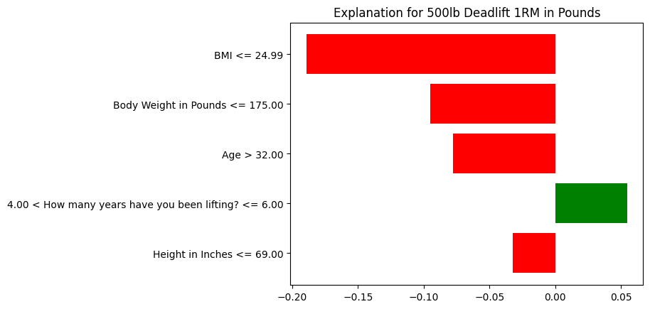

# Lifting Strength Predictor

A machine learning tool for predicting powerlifting 1-rep maxes and lift success probability, built as a more personalized alternative to [strengthlevel.com](https://strengthlevel.com).

Unlike standard strength calculators that only use bodyweight, this model incorporates **age, height, BMI, and years of lifting experience** as predictive features — capturing the fuller picture of an athlete's strength potential.

---

## Motivation

Most online strength standards (e.g. strengthlevel.com) classify lifters using bodyweight alone. This ignores obvious real-world factors: a 25-year-old with 8 years of experience will outperform a 50-year-old beginner at the same bodyweight. This project attempts to correct that by training on real survey data from the lifting community.

---

## Dataset

**Source:** [Weightroom 2021 Powerlifting Survey](https://www.reddit.com/r/weightroom/comments/pwi8zi/wr_survey_results_the_deadlift/) — a community-collected dataset from the r/weightroom subreddit containing self-reported lifter profiles including bodyweight, height, age, training age, and 1RM estimates for squat, bench, and deadlift.

> The CSV file is not included in this repo. Download the dataset from the original Reddit thread and place it in the project root as:
> ```
> WR 2021 Deadlift Data - Weightroom Survey 2021.csv
> ```

---

## Models

### `Strength_level_calculator.py` — XGBoost + LIME (Local Explainability)

Trains a binary classifier to predict the **probability that a lifter can hit a specific target weight right now** on a given lift. Uses **LIME (Local Interpretable Model-agnostic Explanations)** to explain individual predictions — showing which features drove the model's output for a specific athlete profile.

**Example — predicting a 500lb deadlift for a 160lb, 37-year-old lifter with 6 years of experience:**

```python
predictor.train_for_lift('Deadlift 1RM in Pounds', 500)
predictor.predict_probability(weight=160, age=37, height_inches=69, years_lifting=6, show_lime=True)
```

```
--- Model trained for 500lb+ Deadlift 1RM in Pounds (XGBoost) ---
Dataset Size: 1084 complete lifter profiles used (NaNs excluded).

=======================================================
PREDICTION FOR: 500lb+ Deadlift 1RM in Pounds
-------------------------------------------------------
Input Stats:
  Weight:        160 lbs
  Height:        69 inches
  Age:           37
  Years Lifting: 6
  Calculated BMI: 23.63
-------------------------------------------------------
PROBABILITY OF SUCCESS: 5.93%
PROBABILITY OF FAILURE: 94.07%
=======================================================

LIME Influence (Why it gave this probability):
 -> BMI <= 24.99                                          : -0.1893 (Decreases Success)
 -> Body Weight in Pounds <= 175.00                       : -0.0949 (Decreases Success)
 -> Age > 32.00                                           : -0.0776 (Decreases Success)
 -> 4.00 < How many years have you been lifting? <= 6.00  :  0.0546 (Increases Success)
 -> Height in Inches <= 69.00                             : -0.0326 (Decreases Success)
```



### `Strength_Potential_Calculator.py` — Gradient Boosting Regressor + Percentile Ranking

Trains a regression model to predict expected 1RM for each lift (squat, bench, deadlift, total), then computes a **Z-score and percentile rank** to show the **probability that a lifter could exceed their current numbers** relative to the population. Also outputs global feature importance to show which variables most influence predicted strength potential.

**Example — profiling a lifter aged 34, 160lbs, 69in, 4 years lifting (S/B/D: 320/220/500):**

```python
report = predictor.predict_user(age=34, weight=160, height=69, years_lifting=4,
                                squat=320, bench=220, deadlift=500)
```

```json
{
  "Squat": {
    "Predicted_lbs": 271.6,
    "Actual_lbs": 320,
    "Strength_Gap": 48.4,
    "Z_Score": 0.84,
    "Prob_to_Exceed": "20.04%",
    "Top_Influences": [
      ["BMI", 0.361],
      ["Body Weight in Pounds", 0.274],
      ["How many years have you been lifting?", 0.248]
    ]
  },
  "Bench": {
    "Predicted_lbs": 209.2,
    "Actual_lbs": 220,
    "Strength_Gap": 10.8,
    "Z_Score": 0.29,
    "Prob_to_Exceed": "38.74%",
    "Top_Influences": [
      ["Body Weight in Pounds", 0.460],
      ["How many years have you been lifting?", 0.272],
      ["BMI", 0.174]
    ]
  },
  "Deadlift": {
    "Predicted_lbs": 353.4,
    "Actual_lbs": 500,
    "Strength_Gap": 146.6,
    "Z_Score": 2.22,
    "Prob_to_Exceed": "1.33%",
    "Top_Influences": [
      ["Body Weight in Pounds", 0.427],
      ["How many years have you been lifting?", 0.283],
      ["BMI", 0.176]
    ]
  },
  "Total": {
    "Predicted_lbs": 842.4,
    "Actual_lbs": 1040,
    "Strength_Gap": 197.6,
    "Z_Score": 1.33,
    "Prob_to_Exceed": "9.14%",
    "Top_Influences": [
      ["Body Weight in Pounds", 0.388],
      ["How many years have you been lifting?", 0.272],
      ["BMI", 0.236]
    ]
  }
}
```

---

## Features Used

| Feature | Description |
|---|---|
| Age | Lifter age in years |
| Body Weight in Pounds | Self-reported bodyweight |
| Height in Inches | Self-reported height |
| How many years have you been lifting? | Training age |
| BMI | Derived: (weight_kg) / (height_m)² |

---

## Installation

```bash
pip install -r requirements.txt
```

**requirements.txt:**
```
pandas
numpy
xgboost
scikit-learn
scipy
lime
matplotlib
```

---

## Usage

Update the `csv_path` variable at the bottom of each script to point to your local copy of the dataset, then run:

```bash
# Classification + LIME explanation
python Strength_level_calculator.py

# Regression + percentile ranking
python Strength_Potential_Calculator.py
```

---

## Explainability Techniques

This project uses two complementary XAI (Explainable AI) approaches:

- **LIME** (`Strength_level_calculator.py`) — fits a locally linear model around a single prediction to explain *why* the classifier assigned that probability to a specific athlete. Produces per-feature contribution scores for individual instances.
- **Global feature importance** (`Strength_Potential_Calculator.py`) — uses gradient boosting's built-in impurity-based importance to show which features drive predictions *across the entire dataset*, not just for one individual.

Together, these give both local (per-athlete) and global (population-level) interpretability — a distinction that is central to XAI research.

---

## Repo Structure

```
lifting-strength-predictor/
├── README.md
├── requirements.txt
├── Strength_level_calculator.py      (XGBoost + LIME classifier)
├── Strength_Potential_Calculator.py  (GradientBoosting regressor + percentile)
├── lime_example.png                  (LIME chart — save from classifier output)
└── data/
    └── README.md                     (dataset info and source link)
```